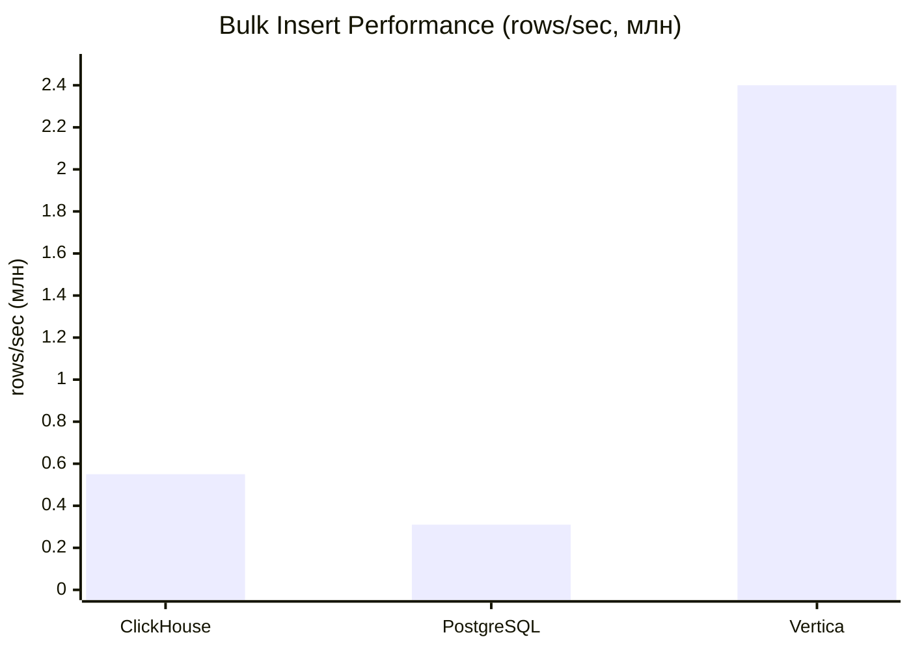
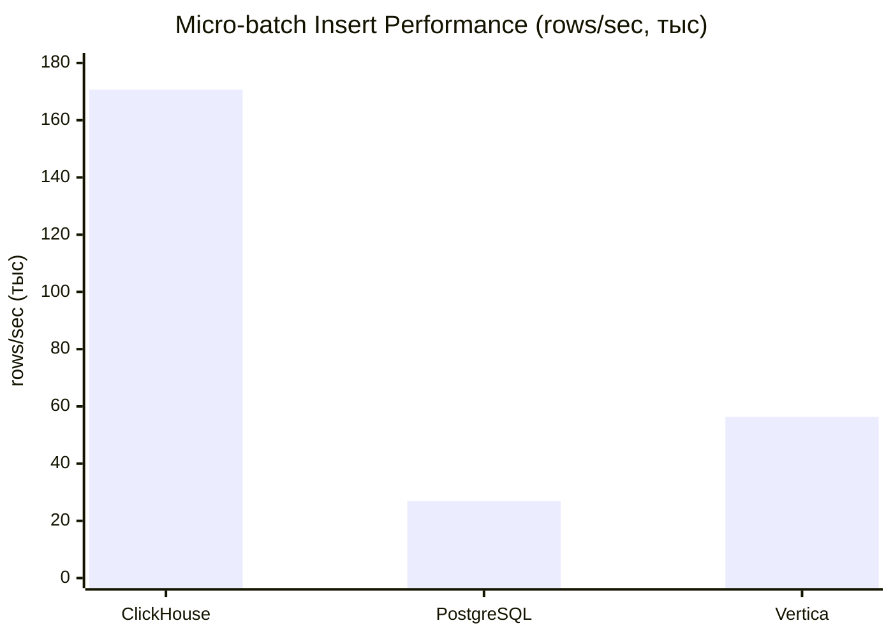
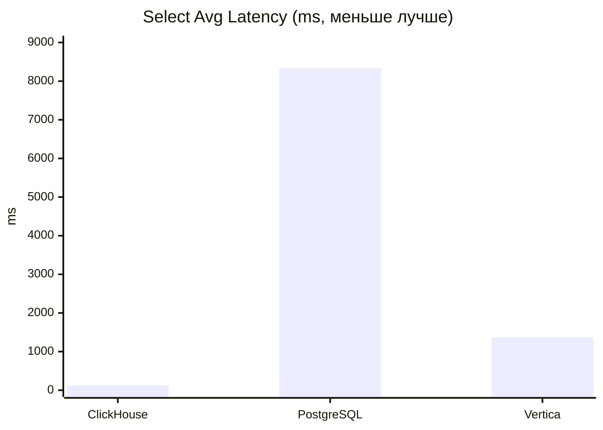
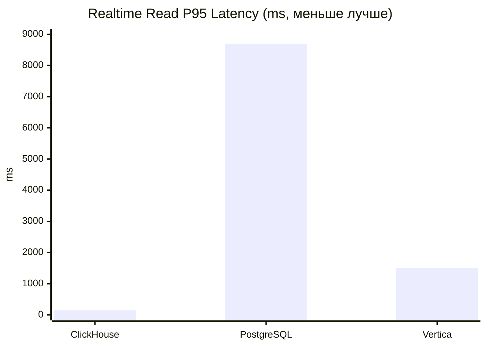
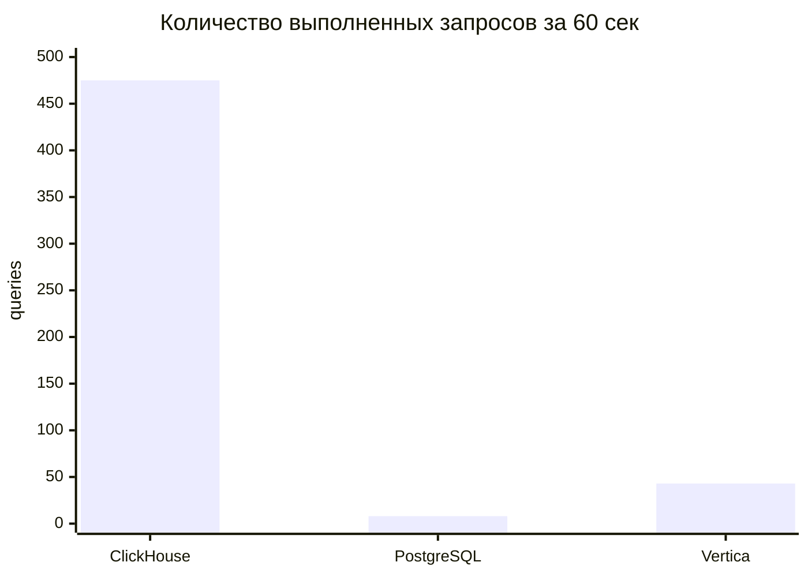

# 📊 Storage Bench: ClickHouse vs PostgreSQL vs Vertica

Исследование производительности колоночных и строковых СУБД для пайплайна **Kafka → Хранилище → Аналитика**.

[](LICENSE)
[](https://www.python.org/downloads/)
[](https://www.docker.com/)
[](https://clickhouse.com/)
[](https://www.postgresql.org/)
[](https://www.vertica.com/)
[]()

---

## 🎯 О проекте

Проект представляет собой **нагрузочное исследование трёх СУБД** для определения оптимального хранилища под пайплайн загрузки и аналитической обработки событий из Apache Kafka.

### Тестируемые СУБД

| СУБД | Тип | Версия | Особенности |
|---|---|---|---|
| 🟡 **ClickHouse** | Колоночная OLAP | 24.x | Встроенная интеграция с Kafka |
| 🐘 **PostgreSQL** | Строковая OLTP/OLAP | 16 | Универсальность, ACID |
| 🔵 **Vertica** | Колоночная MPP OLAP | 9.2 | Корпоративный DWH |

### Ключевые метрики

- ⚡ Скорость массовой загрузки (bulk insert)
- 📦 Скорость пакетной вставки (micro-batch insert)
- 🔍 Скорость агрегирующих запросов (select)
- 🔄 Стабильность чтения под фоновой нагрузкой записи
- 📈 Возможности горизонтального масштабирования
- 🔌 Доступность интеграции с Kafka

---

## 🔬 Методика тестирования

### Генерация тестовых данных

```bash
# 10 млн строк, кусками по 500 тыс., 8 параллельных процессов
python src/generate_csv.py \
  --total 10000000 \
  --chunk 500000 \
  --workers 8 \
  --outdir data/csv
```

### Параметры тестирования

| Параметр | Значение |
|---|---|
| Объём данных | 10 000 000 записей |
| Формат данных | CSV (20 файлов по 500 000 строк) |
| Размер записи | 8 полей |
| Повторений select | 10 (после 2 warmup) |
| Длительность realtime теста | 60 секунд |
| Размер realtime пачки | 1 000 строк |
| Интервал realtime вставки | 0.5 сек |

### Тесты

| Тест | Описание | Команда |
|---|---|---|
| 1. Bulk insert | Загрузка 10 млн строк из CSV | `python src/load_<db>.py` |
| 2. Micro-batch insert | 10 пачек по 10 000 строк | `python src/bench_static.py` |
| 3. Select | Агрегирующий запрос GROUP BY | `python src/bench_static.py` |
| 4. Realtime | Фоновая вставка + чтение | `python src/bench_realtime.py` |

---

## 📊 Результаты тестирования

### Сводная таблица

| Метрика | 🟡 ClickHouse | 🐘 PostgreSQL | 🔵 Vertica | 🏆 Лидер |
|---|---:|---:|---:|---|
| **Bulk insert, rows/sec** | 553 535 | 305 555 | **2 404 484** | 🔵 Vertica |
| **Bulk insert, сек** | 18.07 | 32.73 | **4.16** | 🔵 Vertica |
| **Micro-batch insert, rows/sec** | **170 740** | 26 905 | 56 311 | 🟡 ClickHouse |
| **Micro-batch avg, ms** | **34.3** | 345.9 | 146.7 | 🟡 ClickHouse |
| **Select avg, ms** | **122.7** | 8 329.7 | 1 367.3 | 🟡 ClickHouse |
| **Select p95, ms** | **133.6** | 9 221.9 | 1 434.3 | 🟡 ClickHouse |
| **Realtime insert, rows/sec** | **1 999** | 1 763 | 1 989 | 🟡 ClickHouse |
| **Realtime read p95, ms** | **146.9** | 8 693.4 | 1 500.7 | 🟡 ClickHouse |
| **Realtime queries / 60s** | **475** | 8 | 43 | 🟡 ClickHouse |
| **SLA < 10s** | ✅ | ⚠️ на грани | ✅ | 🟡 ClickHouse |

### Bulk insert (rows/sec)



### Micro-batch insert (rows/sec)



### Select latency (avg, ms)



### Realtime read latency (p95, ms)



### Realtime queries count за 60 секунд



### Детальные результаты

<details>
<summary>📋 ClickHouse (развернуть)</summary>

```json
{
  "db": "clickhouse",
  "bulk_insert": {
    "rows": 10000000,
    "seconds": 18.07,
    "rows_per_sec": 553535
  },
  "micro_batch_insert": {
    "rows": 100000,
    "seconds": 0.586,
    "rows_per_sec": 170740.1,
    "batch_avg_ms": 34.3,
    "batch_p95_ms": 41.6,
    "batch_max_ms": 45.8
  },
  "select": {
    "avg_ms": 122.7,
    "p95_ms": 133.6,
    "max_ms": 136.1
  },
  "realtime": {
    "duration_s": 60.03,
    "writer": {
      "inserted_rows": 120000,
      "rows_per_sec": 1999.0,
      "insert_avg_ms": 31.5,
      "insert_p95_ms": 50.0,
      "insert_max_ms": 64.8
    },
    "read_under_load": {
      "queries": 475,
      "avg_ms": 126.4,
      "p95_ms": 146.9,
      "max_ms": 189.2
    },
    "sla_read_max_lt_10s": true
  }
}
```

</details>

<details>
<summary>📋 PostgreSQL (развернуть)</summary>

```json
{
  "db": "postgres",
  "bulk_insert": {
    "rows": 10000000,
    "seconds": 32.73,
    "rows_per_sec": 305555
  },
  "micro_batch_insert": {
    "rows": 100000,
    "seconds": 3.717,
    "rows_per_sec": 26904.9,
    "batch_avg_ms": 345.9,
    "batch_p95_ms": 522.6,
    "batch_max_ms": 574.8
  },
  "select": {
    "avg_ms": 8329.7,
    "p95_ms": 9221.9,
    "max_ms": 9368.8
  },
  "realtime": {
    "duration_s": 68.08,
    "writer": {
      "inserted_rows": 120000,
      "rows_per_sec": 1762.7,
      "insert_avg_ms": 54.8,
      "insert_p95_ms": 104.5,
      "insert_max_ms": 554.4
    },
    "read_under_load": {
      "queries": 8,
      "avg_ms": 8508.0,
      "p95_ms": 8693.4,
      "max_ms": 8703.6
    },
    "sla_read_max_lt_10s": true
  }
}
```

</details>

<details>
<summary>📋 Vertica (развернуть)</summary>

```json
{
  "db": "vertica",
  "bulk_insert": {
    "rows": 10000000,
    "seconds": 4.16,
    "rows_per_sec": 2404484
  },
  "micro_batch_insert": {
    "rows": 100000,
    "seconds": 1.776,
    "rows_per_sec": 56310.8,
    "batch_avg_ms": 146.7,
    "batch_p95_ms": 164.8,
    "batch_max_ms": 167.4
  },
  "select": {
    "avg_ms": 1367.3,
    "p95_ms": 1434.3,
    "max_ms": 1461.6
  },
  "realtime": {
    "duration_s": 60.32,
    "writer": {
      "inserted_rows": 120000,
      "rows_per_sec": 1989.4,
      "insert_avg_ms": 78.0,
      "insert_p95_ms": 110.8,
      "insert_max_ms": 136.8
    },
    "read_under_load": {
      "queries": 43,
      "avg_ms": 1402.7,
      "p95_ms": 1500.7,
      "max_ms": 1536.2
    },
    "sla_read_max_lt_10s": true
  }
}
```

</details>

---

## 🏆 Рекомендации

### Итоговый рейтинг для Kafka-пайплайна

| Критерий | Вес | 🟡 ClickHouse | 🐘 PostgreSQL | 🔵 Vertica |
|---|---|---|---|---|
| Micro-batch insert | 25% | ⭐⭐⭐⭐⭐ | ⭐⭐ | ⭐⭐⭐ |
| Select скорость | 25% | ⭐⭐⭐⭐⭐ | ⭐ | ⭐⭐⭐⭐ |
| Realtime стабильность | 20% | ⭐⭐⭐⭐⭐ | ⭐⭐ | ⭐⭐⭐⭐ |
| Kafka интеграция | 15% | ⭐⭐⭐⭐⭐ | ⭐⭐ | ⭐⭐⭐ |
| Масштабирование | 10% | ⭐⭐⭐⭐⭐ | ⭐⭐⭐ | ⭐⭐⭐⭐ |
| Стоимость/лицензия | 5% | ⭐⭐⭐⭐⭐ | ⭐⭐⭐⭐⭐ | ⭐⭐⭐ |
| **Итоговый балл** | **100%** | **4.90** 🥇 | **1.95** 🥉 | **3.45** 🥈 |

### 🥇 Основная рекомендация: ClickHouse

Для пайплайна **Kafka → Хранилище → Аналитика** рекомендуется **ClickHouse** по следующим причинам:

1. ✅ Лучшая скорость micro-batch insert (**170 740 rows/sec**)
2. ✅ Лучшая скорость агрегирующих запросов (**122.7 ms**)
3. ✅ Лучшая стабильность под нагрузкой (**p95 = 147 ms**)
4. ✅ Встроенная интеграция с Kafka (Kafka table engine)
5. ✅ Отличное горизонтальное масштабирование
6. ✅ Открытая лицензия Apache 2.0

### Альтернативные сценарии

| Сценарий | Рекомендуемая СУБД | Причина |
|---|---|---|
| 🥇 Потоковая аналитика событий из Kafka | **ClickHouse** | Лучший по всем критериям |
| 🥈 Batch-загрузка больших объёмов (ETL) | **Vertica** | Лучший bulk insert |
| 🥉 Смешанный OLTP + умеренная аналитика | **PostgreSQL** | Транзакции + экосистема |
| 🏢 Корпоративный DWH с лицензией | **Vertica** | MPP, enterprise-поддержка |
| 💰 Бюджетный аналитический кластер | **ClickHouse** | Бесплатный, масштабируемый |

---

### Сравнение возможностей масштабирования

| Аспект | 🟡 ClickHouse | 🐘 PostgreSQL | 🔵 Vertica |
|---|---|---|---|
| Горизонтальное масштабирование | ⭐⭐⭐⭐⭐ | ⭐⭐⭐ | ⭐⭐⭐⭐ |
| Репликация | ⭐⭐⭐⭐⭐ | ⭐⭐⭐⭐ | ⭐⭐⭐⭐ |
| Добавление узлов онлайн | ✅ | ⚠️ через Citus | ✅ |
| Разделение storage/compute | ✅ (S3/HDFS) | ❌ | ✅ (Eon Mode) |
| Лицензия | Apache 2.0 | PostgreSQL License | Commercial |


**Дата последнего обновления:** 2026-08-11  
**Версия:** 1.0.5

